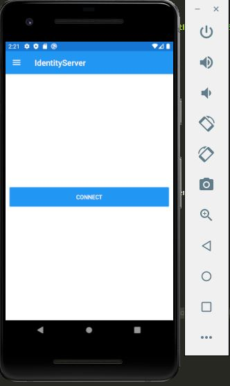
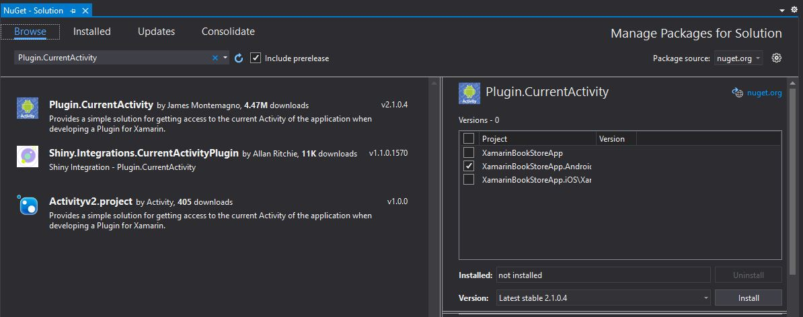

# AbpApiConsumedByXamarin

## Setup BookStore API and IdentityServer

### Create a new ABP project with a separate IdentityServer project

`abp new XamarinBookStoreApi -u blazor -o XamarinBookStoreApi --separate-identity-server`

### Find your IP address

Open a command prompt and enter `ipconfig` to fin you IP address

### replace all instances of localhost with your IP address

Hit CTRL+SHIFT+H to replace all localhost instances in the XamarinBookStoreApi with your IP address

```bash
    https://192.168.1.106:44349" => "https://192.168.1.106:44349"
```


### Add XamarinBookStoreApi_Xamarin section in appsettings.json file of the XamarinBookStoreApi.DbMigrator project

```json
      "XamarinBookStoreApi_Xamarin": {
        "ClientId": "XamarinBookStoreApi_Xamarin",
        "ClientSecret": "1q2w3e*",
        "RootUrl": "https://<your-ip-address>:<port-identityserver>" 
        // RootUrl = "AuthServer:Authority": "https://192.168.1.106:44349" in appsettings.json HttpApi.Host project
      }
```

### Add Xamarin client IdentityServer configuration

In the CreateClientAsync method in class IdentityServerDataSeedContributor of the XamarinBookStoreApi.Domain project

```csharp
  // Xamarin Client
  var xamarinClientId = configurationSection["XamarinBookStoreApi_Xamarin:ClientId"];
  if (!xamarinClientId.IsNullOrWhiteSpace())
  {
      var xamarinRootUrl = configurationSection["XamarinBookStoreApi_Xamarin:RootUrl"].TrimEnd('/');

      await CreateClientAsync(
          name: xamarinClientId,
          scopes: commonScopes,
          grantTypes: new[] { "authorization_code" },
          secret: configurationSection["XamarinBookStoreApi_Xamarin:ClientSecret"]?.Sha256(),
          requireClientSecret: false,
          redirectUri: "xamarinformsclients://callback",
          corsOrigins: new[] { xamarinRootUrl.RemovePostFix("/") }
      );
  }
```

### Update method ConfigureAuthentication of the XamarinBookStoreApiHttpApiHostModule in HttpApi.Host project

To overcome issue _System.InvalidOperationException: IDX20803: Unable to obtain configuration from: 'System.String'.
 ---> System.IO.IOException: IDX20804: Unable to retrieve document from: 'System.String'_  update the ConfigureAuthentication method.

WARNING: Do this only in a development environment, not in a production environment!

```csharp
    private void ConfigureAuthentication(ServiceConfigurationContext context, IConfiguration configuration)
    {
      context.Services.AddAuthentication(JwtBearerDefaults.AuthenticationScheme)
          .AddJwtBearer(options =>
          {
            // ...
            
            options.BackchannelHttpHandler = new HttpClientHandler
            {
              ServerCertificateCustomValidationCallback = HttpClientHandler.DangerousAcceptAnyServerCertificateValidator
            };
          });
    }
```

### DbMigrations

Run the XamarinBookStoreApi.DbMigrator project to apply the database migrations.

### Run Identity, Api and Blazor project

## Xamarin.Forms app

### Create Xamarin.Forms app and setup basic workflow

#### Create a new Xamarin app in Visual Studio


#### add FlyoutItem in file AppShell.xaml of the XamarinBookStoreApp core project

```html
    <FlyoutItem Title="IdentityServer" Icon="icon_identity_server.png">
        <ShellContent Route="IdentityConnectPage" ContentTemplate="{DataTemplate local:IdentityConnectPage}" />
    </FlyoutItem>
    // ... other FlyoutItems here
```

#### Add a new ContentPage IdentityConnectPage.xaml in the Views folder of the XamarinBookStoreApp core project

```html
  <?xml version="1.0" encoding="utf-8" ?>
  <ContentPage xmlns="http://xamarin.com/schemas/2014/forms"
              xmlns:x="http://schemas.microsoft.com/winfx/2009/xaml"
              x:Class="XamarinBookStoreApp.Views.IdentityConnectPage"
                Title="{Binding Title}">
      <ContentPage.Content>
          <StackLayout Padding="10,0,10,0" VerticalOptions="Center">
              <Button VerticalOptions="Center" Text="Connect" Command="{Binding ConnectToIdentityServerCommand}"/>
          </StackLayout>
      </ContentPage.Content>
  </ContentPage>
```

#### Set BindingContext in IdentityConnectPage.xaml.cs in the Views folder

```csharp
  using Xamarin.Forms;
  using Xamarin.Forms.Xaml;
  using XamarinBookStoreApp.ViewModels;

  namespace XamarinBookStoreApp.Views
  {
      [XamlCompilation(XamlCompilationOptions.Compile)]
      public partial class IdentityConnectPage : ContentPage
      {
          public IdentityConnectPage()
          {
              InitializeComponent();
              this.BindingContext = new IdentityConnectViewModel();
          }
      }
  }
```

#### Create a new file IdentityConnectViewModel.cs in the ViewModels folder of the XamarinBookStoreApp project

```csharp
using System;
using Xamarin.Forms;

namespace XamarinBookStoreApp.ViewModels
{
    public class IdentityConnectViewModel : BaseViewModel
    {
        public Command ConnectToIdentityServerCommand { get; }

        public IdentityConnectViewModel()
        {
            Title = "IdentityServer";
            ConnectToIdentityServerCommand = new Command(ConnectToIdentityServer);
        }

        private void ConnectToIdentityServer(object obj)
        {
            throw new NotImplementedException();
        }
    }
}
```

#### Run the XamarinBookStoreApp

Open the Android Device Manager and launch an android device.

Run the XamarinBookStoreApp.



### Make the XamarinBookStoreApp.Android IdentityServer ready

#### Open Nuget Package Manager and install Plugin.CurrentActivity Nuget Package in the Android app



#### Open class MainActivity and update its contents

```csharp
  // Add the 2 using statements below
  using Xamarin.Forms;
  using Plugin.CurrentActivity;
  
  using Android.App;
  using Android.Content.PM;
  using Android.Runtime;
  using Android.OS;

  namespace XamarinBookStoreApp.Droid
  {
      [Activity(Label = "XamarinBookStoreApp", Icon = "@mipmap/icon", Theme = "@style/MainTheme", MainLauncher = true, ConfigurationChanges = ConfigChanges.ScreenSize | ConfigChanges.Orientation | ConfigChanges.UiMode | ConfigChanges.ScreenLayout | ConfigChanges.SmallestScreenSize )]
      public class MainActivity : global::Xamarin.Forms.Platform.Android.FormsAppCompatActivity
      {
          protected override void OnCreate(Bundle savedInstanceState)
          {   
              // Add this line of code
              DependencyService.Register<ChromeCustomTabsBrowser>();

              TabLayoutResource = Resource.Layout.Tabbar;
              ToolbarResource = Resource.Layout.Toolbar;

              base.OnCreate(savedInstanceState);

              Xamarin.Essentials.Platform.Init(this, savedInstanceState);
              global::Xamarin.Forms.Forms.Init(this, savedInstanceState);
              // Add this line of code
              CrossCurrentActivity.Current.Init(this, savedInstanceState);
              LoadApplication(new App());
          }
          public override void OnRequestPermissionsResult(int requestCode, string[] permissions, [GeneratedEnum] Android.Content.PM.Permission[] grantResults)
          {
              Xamarin.Essentials.Platform.OnRequestPermissionsResult(requestCode, permissions, grantResults);

              base.OnRequestPermissionsResult(requestCode, permissions, grantResults);
          }
      }
  }
```

### Generate a ChromeCustomTabsBrowser.cs class in a new file and update its contents

```csharp
  using Android.Support.CustomTabs;
  using Android.App;
  using Android.Content;
  using Plugin.CurrentActivity;
  using System;
  using System.Threading;
  using System.Threading.Tasks;

  namespace XamarinBookStoreApp.Droid
  {
      public class ChromeCustomTabsBrowser : IBrowser
      {
          private readonly Activity _context;
          private readonly CustomTabsActivityManager _manager;

          public ChromeCustomTabsBrowser() : this(CrossCurrentActivity.Current.Activity) { }


          public ChromeCustomTabsBrowser(Activity context)
          {
              _context = context;
              _manager = new CustomTabsActivityManager(_context);
          }

          public Task<BrowserResult> InvokeAsync(BrowserOptions options, CancellationToken cancellationToken = default)
          {
              var task = new TaskCompletionSource<BrowserResult>();

              var builder = new CustomTabsIntent.Builder(_manager.Session)
                //.SetToolbarColor(Color.FromArgb(255, 52, 152, 219))
                .SetShowTitle(true)
                .EnableUrlBarHiding();

              var customTabsIntent = builder.Build();

              // ensures the intent is not kept in the history stack, which makes
              // sure navigating away from it will close it
              customTabsIntent.Intent.AddFlags(ActivityFlags.NoHistory);

              Action<string> callback = null;
              callback = url =>
              {
                  OidcCallbackActivity.Callbacks -= callback;

                  task.SetResult(new BrowserResult()
                  {
                      Response = url
                  });
              };

              OidcCallbackActivity.Callbacks += callback;

              customTabsIntent.LaunchUrl(_context, Android.Net.Uri.Parse(options.StartUrl));

              return task.Task;
          }
      }
  }
```

Hover over IBrowser and Install package IdentityModel.OidcClient.Browser;  

### Generate a OidcCallbackActivity.cs class in a new file and update its contents

```csharp
  using Android.App;
  using Android.Content;
  using Android.OS;
  using Android.Util;
  using System;

  namespace XamarinBookStoreApp.Droid
  {
      [Activity(Label = "OidcCallbackActivity")]
      [IntentFilter(new[] { Intent.ActionView },
              Categories = new[] { Intent.CategoryDefault, Intent.CategoryBrowsable },
              DataScheme = "xamarinformsclients")]
      //DataHost = "callback")]
      public class OidcCallbackActivity : Activity
      {
          public static event Action<string> Callbacks;

          public OidcCallbackActivity()
          {
              Log.Debug("OidcCallbackActivity", "constructing OidcCallbackActivity");
          }

          protected override void OnCreate(Bundle savedInstanceState)
          {
              base.OnCreate(savedInstanceState);

              Callbacks?.Invoke(Intent.DataString);

              Finish();

              StartActivity(typeof(MainActivity));
          }
      }
  }
```

